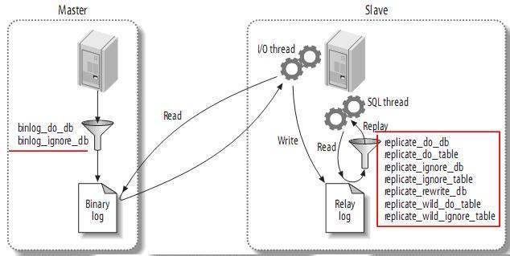
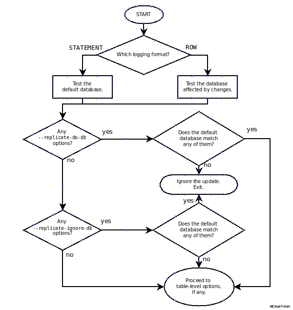
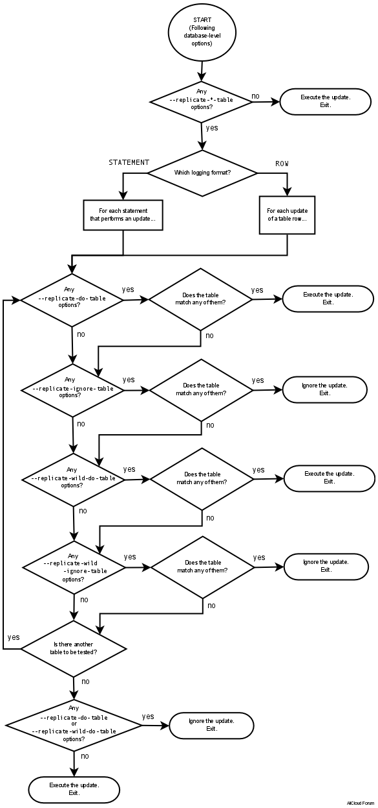
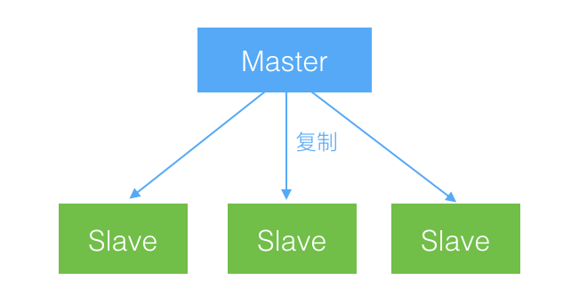
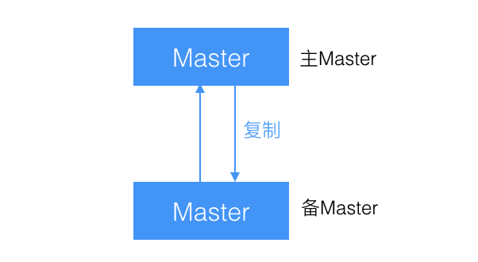
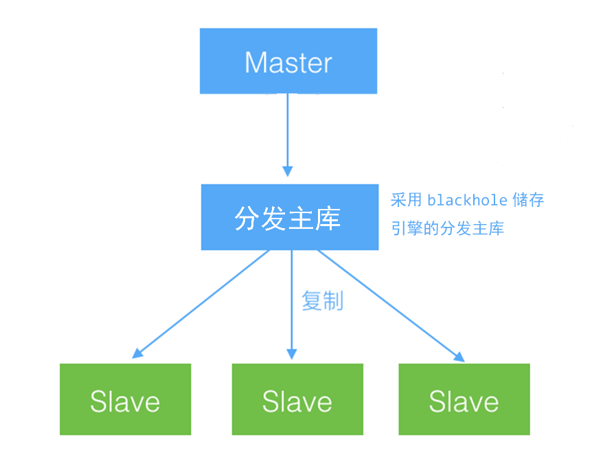

## 复制

复制解决的基本问题是让一台服务器的数据与其它服务器保持同步。MySQL支持两种复制方式：基于行的复制和基于语句的复制。基于语句的复制早在MySQL 3.23版本中就存在，而基于行的复制在5.1版本中才被加进来。这两个复制方式都是通过在主库上记录二进制日志、在备库重放日志的方式来实现异步的数据复制。

### 复制解决的问题

#### 数据分布

在不同地理位置分布数据备份

#### 负载均衡

通过MySQL复制可以将读操作分布到多个服务器上，实现对读密集型应用的优化，并且实现很方便，通过简单的代码修改就能实现基本的负载均衡。

#### 备份

对于备份来说，复制是一项很有意义的技术补充。

#### 高可用和故障切换

复制能够帮助应用避免MySQL单点失败。

#### MySQl升级测试

使用更高版本的MySQL作为备库，保证在升级全部实例前，查询能够在备库按照预期执行。

### 复制过程


第一步是在主库上记录二进制日志。在每次准备提交事务完成数据更新前，主库将数据更新的事件记录到二进制日志中。MySQL会按事务提交的顺序而非语句执行的顺序来记录二进制日志。在记录二进制日志后，主库会告诉储存引擎可以提交事务了。

下一步，备库将主库的二进制日志复制到其本地的中继日志中。首先，备库会启动一个工作线程，成为I/O线程，I/O线程跟主库建立一个普通的客户端连接，然后在主库上启动一个特殊的二进制转储（binlog dump）线程，这个二进制转储线程会读取主库上二进制日志中的事件。它不会对事件进行轮询。如果该线程追赶上了主库，它将进入睡眠状态，直到主库发送信号量通知其有新的事件产生时才会被唤醒，备库I/O线程会将接收到的事件记录到中继日志中。

备库的SQL线程执行最后一步，该线程从中继日志中读取事件并在备库执行，从而实现备库数据的更新。当SQL线程追赶上I/O线程时，中继日志通常已经在系统缓存中，所以中继日志的开销很低。SQL线程执行的事件也可以通过配置选项来决定是否写入其自己的二进制日志中，这在有些场景下很有用。

### 配置复制

1. 在每台服务器上创建复制账号
2. 配置主库和备库
3. 通知备库连接到主库并从主库复制数据

#### 创建复制账号

```sql
GRANT REPLICATION SLAVE,REPLICATION CLIENT ON *.* TO repl@'localhost' 
IDENTIFIED BY 'password'
```

#### 主库配置

```properties
[mysqld]
log_bin=mysql-bin
# 事务提交之前同步二进制日志到硬盘
sync_binlog=1						
server_id=1

# 每次事务提交时日志刷新
innodb_flush_logs_at_trx_commit	
# 开启在XA事务中对两段提交的支持
innodb_support_xa=1
```

#### 从库配置

```properties
[mysqld]
log_bin=mysql-bin
relay_log=mysql-relay-bin
server_id=2

# 从库开启二进制日志
log_slave_updates=1
# 防止从库在崩溃后自动启动复制
skip_slave_start
read_only=1

# 在每次sync_master_info事件之后同步master.info到硬盘
sync_master_info=1
# 在每次sync_relay_info事件之后同步中继日志到硬盘
sync_relay_log=1
# 在每次sync_relay_log_info事件之后同步中继日志到硬盘
sync_relay_log_info=1
```

#### 启动复制

基本命令：

```mysql
mysql> CHANGE MASTER TO MASTER_HOST="SERVER1", 
		MASTER_USER='repl',
		MASTER_PASSWORD="passwrod",
		MASTER_LOG_FILE='mysql-bin.000001',
		MASTER_LOG_POS=0;
mysql> START SLAVE;
```

运行命令开始复制：

```
mysql> START SLAVE;
```

可通过`SHOW SLAVE STATUS`查看复制状态。

### 从另一个服务器开始复制

- 使用冷备份 

  最基本的方法是关闭主库，把数据复制到备库。

- 使用热备份

  如果仅使用MyISAM表，可在主库运行时使用`mysqlhotcopy`或`rsync`来复制数据。

- 使用`mysqldump`

  如果只包含InnoDB表，那么可以使用以下命令来转储主库数据并将其加载到备库，

  ```shell
  mysqldump --single-transaction --all-databases --master-date=1 --host=server 1 
  |mysql --host=server2
  ```

- 使用快照或备份

  只要知道对应二进制日志坐标，就可以使用主库的快照或备份来初始化备库。

- 使用Percona Xtrabackup

  Percona的Xtrabackup是一款开源的热备份工具。

- 使用另外的备库

  可以使用任何一种提及的克隆或者拷贝计数来从任意一台备库上将数据克隆到另外一台服务器。

### 复制原理

#### 基于语句的复制

在MySQL 5.0及以前的版本中只支持基于语句的复制。基于语句的复制模式下，主库会记录那些造成数据更改的查询，当备库读取并重放这些事件时，实际上只是把数据库上执行过的SQL在执行一遍。

这样好处是实现相当简单，简单地记录和执行这些语句，就能够让主备保持同步。另一个好处是二进制日志里的事件更加紧凑，所以相对而言，基于语句的模式不会使用太多带宽。

缺点就在于主库上的数据更新除了执行的语句外，可能还依赖于其它因素。例如，同一条语句在主库和备库执行的时间可能不同。因此在传输的二进制日志中，除了查询语句，还包括一些元数据信息，如当前的时间戳。一些函数，如CURRENT_USER()也无法正确使用。储存过程和触发器在使用语句的复制也可能存在问题。另外一个问题是更新必须是串行的。

#### 基于行的复制

MySQL 5.1开始支持基于行的复制，这种方式会将实际数据记录在二进制日志中。最大的好处是可以正确地复制每一行。由于无需重发更新主库的查询，使得基于行的复制模式能够更高效地复制复制。而当有全表更新的查询时，使用基于行的复制开销会很多，因为每一行的数据都会被记录到二进制日志中，这使得二进制日志时间非常庞大。

### 复制文件

- mysql-bin.index

  当在服务器上开启二进制日志时，同时会生成一个和二进制日志同名的但以.indx作为后缀的文件，该文件用于记录磁盘上的二进制日志文件，每一行包含了二进制日志文件的名字。

- mysql-relay-bin.index

  这个文件时中继日志的索引文件，和mysql-bin.index相似。

- master.info

  这个文件用于保存备库连接到主库所需要的信息，格式为纯文本，不同的MySQL版本记录的信息也可能不同。

- relay-log.info

  这个文件包含了当前备库复制的二进制日志和中继日志坐标。

### 复制过滤器

复制过滤选项允许你仅复制服务器上的一部分数据，不过可能没有想象中那么好用。有两种复制过滤方式：在主库上过滤记录到二进制日志中的事件，以及在备库上过滤记录到中继日志的事件。



#### 主库

对哪些库记录二进制日志配置参数

```properties
binlog_do_db=
binlog_ignore_db=
```

#### 备库

##### 库级别

###### 配置参数

```properties
# 允许复制
replicate_do_DB=A
replicate_do_DB=B

# 忽略
replicate_ignore_DB=A
replicate_ignore_DB=B
```

###### 推算流程



##### 表级别

###### 配置参数

```properties
# 允许复制
replicate_do_table=A.table1
replicate_wild_do_table=b.%

#忽略
replicate_ignore_table=B.table1
replicate_wild_ignore_table=B.%
```

###### 推算流程



### 复制拓扑

#### 一主库多备库



- 为不同的角色使用不同的备库。例如：添加不同的索引、使用不同的储存引擎。
- 把一台备库当作待用的主库，除了复制没有其它的数据传输。
- 将一台备库放在远程数据中心，用作灾难恢复。
- 延迟一个或多个备库，已备灾难恢复。
- 使用其中一个备库，用作备份、培训、开发或者测试使用服务器。

#### 主主复制



- 两个处在不同地理位置的数据库，且都需要可写。两个可写的服务器会导致冲突，MySQL 5.0增加了新特性，就是配置`auto_increment`和`auto_increment_offset`，这可以让MySQL自动为INSERT语句选择互不冲突的值，使得这种配置稍微安全了点。

#### 主库、分发主库以及备库



将主库的负载转移到分发主库上。分发主库的唯一目的就是提取和提供主库的二进制日志。为了避免在分发主库上做实际的查询，可以将它的表修改为blackhole储存引擎。

### 复制方案

#### 选择性复制

为了利用访问局部性原理，将需要读的工作集驻留在内存中，可以复制少量复制到备库中。如果每个备库中拥有主库的一部分数据，并且将读分配给备库，就可以很好的利用备库的内存。并且每个备库止呕主库一部分写入负载，这样主库的能力更强并能保证备库延迟。

#### 分离功能

许多应用混合了在线事务处理（OLTP）和在线数据分析（OLAP）的查询。OLTP查询比较短并且是事务性的，OLAP查询则通常很大，并且不要求绝对最新的数据。这两种查询给服务器带来的负担完全不同，因此它们需要不同的配置，甚至可能使用不同的储存引擎或者硬件。

#### 数据归档

可以在备库上实现数据归档，，也就是说可以在备库上保留主库上删除过的数据，在主库上通过delete语句删除数据是确保delete语句不传递到备库就可以实现。

#### 只读备库

将佩枯设置为只读，以防止在备库进行的无意识修改斗志复制中断。可以通过read_only选项来实现。

#### 模拟多主库复制

当前MySQL 不知处多主库复制。但是可以把一台备库轮流指向多个主库的方式来模拟这种结构。

#### 创建日志服务器

使用MySQL复制的另一个用途就是创建没有数据的日志服务器。它唯一目的就是更加容易重放并且/或者过滤二进制日志。

## 新特性

### MYSQL 5.5

##### 传统复制

master事务的提交不需要经过slave的确认，slave是否接收到master的binlog，master并不关注。slave接收到master binlog后先写relay log，最后异步地去执行relay log中的sql应用到自身。由于master的提交不需要确保slave relay log是否被正确接受，当slave接受master binlog失败或者relay log应用失败，master无法感知。

假设master发生宕机并且binlog还没来得及被slave接收，而切换程序将slave提升为新的master，就会出现数据不一致的情况！另外，在高并发的情况下，传统的主从复制，从节点可能会与主产生较大的延迟。

##### 半同步复制

基于传统异步存在的缺陷，mysql在5.5版本推出半同步复制。可以说半同步复制是传统异步复制的改进，在master事务的commit之前，必须确保一个slave收到relay log并且响应给master以后，才能进行事务的commit。但是slave对于relay log的应用仍然是异步进行的。

### MYSQL 5.6

#### GTID

GTID是MySQL 5.6版本添加的新特性。全称 Global Transaction Identifiers ，是基于全局事务标识的复制。这个标识是主库上对应每个事务的唯一标识。

在加入GTID之后，重启从库之后，不需要重新进行位置的指向，只需要连接到主库即可，剩下的步骤将会是自动的。 

GTID的格式为：

```properties
GTID = source_id:transaction_id
```

其中`source_id`标识主库，通常使用服务器的`server_uuid`作为标识。而`transaction_id`则是严格按照服务器上事务的提交顺序决定的有序数字。

##### 配置

```properties
gtid_mode=ON  
log_bin=ON
# 阻止不支持语句的执行
enforce-gtid-consistency

log-slave-updates=ON 
```

##### 启动命令

```mysql
mysql> CHANGE MASTER TO
          MASTER_HOST = host,
          MASTER_PORT = port,
          MASTER_USER = user,
          MASTER_PASSWORD = password,
          MASTER_AUTO_POSITION = 1;
mysql> START SLAVE;
```

##### 限制

 因为GTID是基于事务的, 当使用GTID时, 一些mysql的特性将会收到限制. 

-  更新涉及到非事务引擎，  当在一个事务中, 既更新基于事务引擎的表, 又更新了非事务引擎的表, 这种情况会导致这个trx产生多个GTID. 这就破坏了GTID和事务之间一对一的关系, 进而导致基于GTID的主从复制不能正确工作。
-  CREATE TABLE ... SELECT语句， 当使用row-based格式的binlog, 这个语句会产生两个独立的event: 一个新建table, 另外一个插入数据. 如果在trx中执行该语句, 这两个event可能会产生相同的GTID, 也就意味着插入数据的那个evnet会被跳过。
-  临时表， 当使用GTID时, 不支持CREATE TEMPORARY TABLE和 DROP TEMPORARY TABLE 这两个语句, 但是如果在事务外, 而且autocommit=1时, 可以执行这两个语句. 也即是事务内才会有问题, 事务外是可行的。

#### 从库并发

MySQL 5.6添加的新特性，从库支持在多线程上并行执行事务。当并行执行开启后，从库的SQL线程将作为多个从库工作线程的调度器，从库工作线程的数量由`slave_parallel_workers`配置。

```properties
# 设置备库的并发
slave-parallel-workers = 4
# 利用组提交的逻辑值做并发
slave-parallel-type = LOGICAL_CLOCK
```

### MYSQL 5.7

#### 组复制

MySQL Group Replication，简称MGR，基于传统异步复制和半同步复制的缺陷——数据的一致性问题无法保证，MySQL官方在5.7.17版本正式推出组复制。由若干个节点共同组成一个复制组，一个事务的提交，必须经过组内大多数节点（N / 2 + 1）决议并通过，才能得以提交。组复制依靠分布式一致性协议(Paxos协议的变体)，实现了分布式下数据的最终一致性。一个复制组由若干个节点(数据库实例)组成，组内各个节点维护各自的数据副本(Share Nothing)，通过一致性协议实现原子消息和全局有序消息，来实现组内实例数据的一致。

##### 模式

 MGR提供了single-primary和multi-primary两种模式。其中，single-primary mode(单写模式) 组内只有一个节点负责写入，读可以从任意一个节点读取，组内数据保持最终一致；multi-primary mode(多写模式)，即写会下发到组内所有节点，组内所有节点同时可读，也是能够保证组内数据最终一致性 

1. 单主模式

   在这种模式下，一次只有一台服务器接受更新，在主服务器发生故障的情况下，该组会自动选择新的主服务器，并且服务不会中断，因为所有操作都在后台进行。

2. 多主模式

   在此模式下，所有服务器都可以接受更新。

##### 配置

###### 基本

```properties
# 这个变量确保使用IP而非主机名，避免了配置/etc/hosts的麻烦
report_host=127.0.0.1
report_port=3307
gtid_mode = ON
enforce_gtid_consistency = ON
master_info_repository = TABLE
relay_log_info_repository = TABLE
# 目前只支持ROW模式
binlog-format       = ROW     
# 加载组复制的插件
plugin-load         = group_replication.so
group_replication   = FORCE_PLUS_PERMANENT
# 收集写集合的同时将其记录到二进制日志。写集合基于每行的主键，并且是行更改后的唯一标识此标识将用于检测冲突
transaction-write-set-extraction                   = XXHASH64
#为了避免每次启动自动引导具有相同名称的第二个组,所以设置为OFF。
group_replication_start_on_boot                    = OFF
# 组的名字可以随便起,但不能用主机的GTID! 所有节点的这个组名必须保持一致
group_replication_group_name      = 550fa9ee-a1f8-4b6d-9bfe-c03c12cd1c72
group_replication_local_address   = '127.0.0.1:3307'
# 组中成员访问列表
group_replication_group_seeds     = '127.0.0.1:3307,127.0.0.1:3308,127.0.0.1:3309'
```

###### 单主模式

```properties
# 此为默认配置
group_replication_single_primary_mode              = ON
```

###### 多主

```properties
 #关闭单master模式
group_replication_single_primary_mode                    = OFF
# 多主一致性检查
loose-group_replication_enforce_update_everywhere_checks = ON		

```

##### 启动

主库

```mysql
mysql> SET SQL_LOG_BIN=0;                   
mysql> GRANT REPLICATION SLAVE ON *.* TO rpl_slave@'%' IDENTIFIED BY 'slave@123';
mysql> FLUSH PRIVILEGES;
mysql> reset master;
mysql> SET SQL_LOG_BIN=1;
mysql> CHANGE MASTER TO MASTER_USER='rpl_slave', MASTER_PASSWORD='slave@123' FOR CHANNEL 'group_replication_recovery';
mysql> INSTALL PLUGIN group_replication SONAME 'group_replication.so';
#只在第一个节点执行这个步骤
mysql> SET GLOBAL group_replication_bootstrap_group=ON;
#作为首个节点启动MGR集群
mysql> START GROUP_REPLICATION;
mysql> SET GLOBAL group_replication_bootstrap_group=OFF;
```

从库

```mysql

mysql> SET SQL_LOG_BIN=0;
mysql> GRANT REPLICATION SLAVE ON *.* TO rpl_slave@'%' IDENTIFIED BY 'slave@123';
mysql> FLUSH PRIVILEGES;
mysql> reset master; 
mysql> SET SQL_LOG_BIN=1;
mysql> CHANGE MASTER TO MASTER_USER='rpl_slave', MASTER_PASSWORD='slave@123' FOR CHANNEL 'group_replication_recovery';
mysql> INSTALL PLUGIN group_replication SONAME 'group_replication.so';
mysql> set global group_replication_allow_local_disjoint_gtids_join=ON;
mysql> START GROUP_REPLICATION;
```

查看组成员情况

```mysql
mysql> SELECT * FROM performance_schema.replication_group_members;
```

查看主节点

```mysql
mysql> select variable_value from performance_schema.global_status where variable_name='group_replication_primary_member';
```

一旦数据库故障退组，恢复后无法自动入组，需要作为从库入组，这过程是需要人来操作的。

```mysql
mysql> set global group_replication_allow_local_disjoint_gtids_join=ON;
mysql> start group_replication;
```


