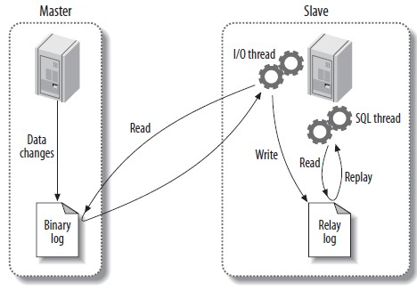

## 复制

复制解决的基本问题是让一台服务器的数据与其它服务器保持同步。MySQL支持两种复制方式：基于行的复制和基于语句的复制。基于语句的复制早在MySQL 3.23版本中就存在，而基于行的复制在5.1版本中才被加进来。这两个复制方式都是通过在主库上记录二进制日志、在备库重放日志的方式来实现异步的数据复制。

### 复制解决的问题

#### 数据分布

在不同地理位置分布数据备份

#### 负载均衡

通过MySQL复制可以将读操作分布到多个服务器上，实现对读密集型应用的优化，并且实现很方便，通过简单的代码修改就能实现基本的负载均衡。

#### 备份

对于备份来说，复制是一项很有意义的技术补充。

#### 高可用和故障切换

复制能够帮助应用避免MySQL单点失败。

#### MySQl升级测试

使用更高版本的MySQL作为备库，保证在升级全部实例前，查询能够在备库按照预期执行。

### 复制过程



第一步是在主库上记录二进制日志。在每次准备提交事务完成数据更新前，主库将数据更新的事件记录到二进制日志中。MySQL会按事务提交的顺序而非语句执行的顺序来记录二进制日志。在记录二进制日志后，主库会告诉储存引擎可以提交事务了。

下一步，备库将主库的二进制日志复制到其本地的中继日志中。首先，备库会启动一个工作线程，成为I/O线程，I/O线程跟主库建立一个普通的客户端连接，然后在主库上启动一个特殊的二进制转储（binlog dump）线程，这个二进制转储线程会读取主库上二进制日志中的事件。它不会对事件进行轮询。如果该线程追赶上了主库，它将进入睡眠状态，直到主库发送信号量通知其有新的事件产生时才会被唤醒，备库I/O线程会将接收到的事件记录到中继日志中。

备库的SQL线程执行最后一步，该线程从中继日志中读取事件并在备库执行，从而实现备库数据的更新。当SQL线程追赶上I/O线程时，中继日志通常已经在系统缓存中，所以中继日志的开销很低。SQL线程执行的事件也可以通过配置选项来决定是否写入其自己的二进制日志中，这在有些场景下很有用。

### 配置复制

1. 在每台服务器上创建复制账号
2. 配置主库和备库
3. 通知备库连接到主库并从主库复制数据

#### 创建复制账号

```sql
GRANT REPLICATION SLAVE,REPLICATION CLIENT ON *.* TO repl@'localhost' 
IDENTIFIED BY 'password'
```

#### 主库配置

```properties
[mysqld]
log_bin=mysql-bin
# 事务提交之前同步二进制日志到硬盘
sync_binlog=1						
server_id=1

# 每次事务提交时日志刷新
innodb_flush_logs_at_trx_commit	
# 开启在XA事务中对两段提交的支持
innodb_support_xa=1
```

#### 从库配置

```properties
[mysqld]
log_bin=mysql-bin
relay_log=mysql-relay-bin
server_id=2

# 从库开启二进制日志
log_slave_updates=1
# 防止从库在崩溃后自动启动复制
skip_slave_start
read_only=1

# 在每次sync_master_info事件之后同步master.info到硬盘
sync_master_info=1
# 在每次sync_relay_info事件之后同步中继日志到硬盘
sync_relay_log=1
# 在每次sync_relay_log_info事件之后同步中继日志到硬盘
sync_relay_log_info=1
```

#### 启动复制

基本命令：

```mysql
mysql> CHANGE MASTER TO MASTER_HOST="SERVER1", 
		MASTER_USER='repl',
		MASTER_PASSWORD="passwrod",
		MASTER_LOG_FILE='mysql-bin.000001',
		MASTER_LOG_POS=0;
mysql> START SLAVE;
```

运行命令开始复制：

```
mysql> START SLAVE;
```

可通过`SHOW SLAVE STATUS`查看复制状态。

### 从另一个服务器开始复制

- 使用冷备份 

  最基本的方法是关闭主库，把数据复制到备库。

- 使用热备份

  如果仅使用MyISAM表，可在主库运行时使用`mysqlhotcopy`或`rsync`来复制数据。

- 使用`mysqldump`

  如果只包含InnoDB表，那么可以使用以下命令来转储主库数据并将其加载到备库，

  ```shell
  mysqldump --single-transaction --all-databases --master-date=1 --host=server 1 
  |mysql --host=server2
  ```

- 使用快照或备份

  只要知道对应二进制日志坐标，就可以使用主库的快照或备份来初始化备库。

- 使用Percona Xtrabackup

  Percona的Xtrabackup是一款开源的热备份工具。

- 使用另外的备库

  可以使用任何一种提及的克隆或者拷贝计数来从任意一台备库上将数据克隆到另外一台服务器。

### 复制原理

#### 基于语句的复制

在MySQL 5.0及以前的版本中只支持基于语句的复制。基于语句的复制模式下，主库会记录那些造成数据更改的查询，当备库读取并重放这些事件时，实际上只是把数据库上执行过的SQL在执行一遍。

这样好处是实现相当简单，简单地记录和执行这些语句，就能够让主备保持同步。另一个好处是二进制日志里的事件更加紧凑，所以相对而言，基于语句的模式不会使用太多带宽。

缺点就在于主库上的数据更新除了执行的语句外，可能还依赖于其它因素。例如，同一条语句在主库和备库执行的时间可能不同。因此在传输的二进制日志中，除了查询语句，还包括一些元数据信息，如当前的时间戳。一些函数，如CURRENT_USER()也无法正确使用。储存过程和触发器在使用语句的复制也可能存在问题。另外一个问题是更新必须是串行的。

#### 基于行的复制

MySQL 5.1开始支持基于行的复制，这种方式会将实际数据记录在二进制日志中。最大的好处是可以正确地复制每一行。由于无需重发更新主库的查询，使得基于行的复制模式能够更高效地复制复制。而当有全表更新的查询时，使用基于行的复制开销会很多，因为每一行的数据都会被记录到二进制日志中，这使得二进制日志时间非常庞大。

### 复制文件

- mysql-bin.index

  当在服务器上开启二进制日志时，同时会生成一个和二进制日志同名的但以.indx作为后缀的文件，该文件用于记录磁盘上的二进制日志文件，每一行包含了二进制日志文件的名字。

- mysql-relay-bin.index

  这个文件时中继日志的索引文件，和mysql-bin.index相似。

- master.info

  这个文件用于保存备库连接到主库所需要的信息，格式为纯文本，不同的MySQL版本记录的信息也可能不同。

- relay-log.info

  这个文件包含了当前备库复制的二进制日志和中继日志坐标。

### 复制方案

#### 选择性复制

为了利用访问局部性原理，将需要读的工作集驻留在内存中，可以复制少量复制到备库中。如果每个备库中拥有主库的一部分数据，并且将读分配给备库，就可以很好的利用备库的内存。并且每个备库止呕主库一部分写入负载，这样主库的能力更强并能保证备库延迟。

#### 分离功能

许多应用混合了在线事务处理（OLTP）和在线数据分析（OLAP）的查询。OLTP查询比较短并且是事务性的，OLAP查询则通常很大，并且不要求绝对最新的数据。这两种查询给服务器带来的负担完全不同，因此它们需要不同的配置，甚至可能使用不同的储存引擎或者硬件。

#### 数据归档

可以在备库上实现数据归档，，也就是说可以在备库上保留主库上删除过的数据，在主库上通过delete语句删除数据是确保delete语句不传递到备库就可以实现。

#### 只读备库

将佩枯设置为只读，以防止在备库进行的无意识修改斗志复制中断。可以通过read_only选项来实现。

#### 模拟多主库复制

当前MySQL 不知处多主库复制。但是可以把一台备库轮流指向多个主库的方式来模拟这种结构。

#### 创建日志服务器

使用MySQL复制的另一个用途就是创建没有数据的日志服务器。它唯一目的就是更加容易重放并且/或者过滤二进制日志。

